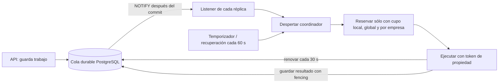

# Worker por eventos de PostgreSQL

## Alcance y estado

Base: `inkora_pse/main`, `c66a3d5002f10ebbfcc5c8fd7f3dd57e42ac9b3d`.
Rama: `codex/worker-events-postgres`, worktree independiente. La raíz histórica no se modifica.

Implementación local en tres bloques revisables:

1. Migración aditiva `0025_emission_worker_events`: leases, evidencia tardía e índices; trigger transaccional con payload vacío.
2. Ejecutor acotado y fencing en `emission_leases.py`, aplicado también con `WAKE_MODE=poll`.
3. Escucha, temporizadores, recuperación y métricas en `emission_worker_runtime.py`.

No se publicaron servicios, configuraron variables remotas ni ejecutaron migraciones remotas. La homologación local utiliza respuestas simuladas. Antes de producción se requiere staging aislado, revisión y autorización de publicación conforme a `RELEASE_CANONICO.md`.

## Funcionamiento



El aviso es una señal, y puede perderse. La tabla es la fuente durable. Se registra `LISTEN` antes del barrido inicial y se repite el barrido al reconectar. Una generación protegida por condición evita perder avisos durante una consulta y agrupa señales repetidas.

El trigger avisa al insertar un trabajo ejecutable, cambiar estado/plazo/prioridad de uno ejecutable o liberar una reserva `processing`. Renovar el lease no genera avisos. Los reintentos y la liberación escalonada de contingencia conservan `available_at`; un temporizador despierta al vencer el próximo plazo. No se gira sobre trabajos ya vencidos que están bloqueados por falta de cupo.

Una conexión de sesión dedicada por réplica escucha; las sesiones SQL de coordinación se cierran antes de esperar. Se valida PostgreSQL, TLS remoto y puerto de sesión. Un desafío aleatorio enviado por `DATABASE_URL` debe recibirse en la conexión de escucha: prueba que ambas rutas alcanzan la misma base. No se registran URLs ni credenciales. Una caída de la escucha activa reconexión con espera de 1 a 30 segundos y se conserva el barrido de respaldo.

## Concurrencia y seguridad fiscal

- Los futuros en curso limitan las reservas: no existe una cola local ilimitada en el executor.
- La reserva usa un advisory lock transaccional breve y luego una nueva sentencia para contar cupos y elegir con `FOR UPDATE SKIP LOCKED`. Esas dos sentencias son intencionales: adquirir el lock dentro de la misma consulta podría usar una fotografía MVCC anterior a otra reserva.
- Se cuentan todas las reservas `processing`, incluidas las vencidas hasta que sean recuperadas. Prioridad, antigüedad y desempate por ID determinan el orden.
- Cada reserva recibe dueño, UUID y vencimiento. El inicio real registra `execution_started_at` y el intento una sola vez. El token no se obtiene de un objeto compartido entre threads.
- Cada réplica renueva en lote únicamente sus tokens vigentes. No revive una reserva vencida. Al apagar, deja de reservar y mantiene los heartbeats durante el drenaje.
- La propiedad se comprueba antes de llamar al proveedor y antes de persistir su respuesta. Un hook de la sesión comprueba también las escrituras ORM de esa ejecución, con bloqueo breve en la misma transacción. No se mantiene el bloqueo de coordinación durante HTTP.
- Reserva vencida sin inicio: vuelve a `retry`. Con inicio: pasa a `pending_confirmation`; requiere conciliación antes de reenviar. La conciliación automática ya existente para el mensaje específico de Smart PSE se conserva.
- Una respuesta tardía queda en `document_emission_attempts.late_result_snapshot` del token anterior, sin reemplazar el trabajo o el documento. Se conserva el resumen fiscal y se omiten archivos XML/PDF superiores del resultado.
- Continúan las validaciones existentes de empresa, ownership, rol, suspensión, suscripción, límites y proveedor. No se cambia el cálculo fiscal, correlativos ni contratos de API.

Esto no proporciona entrega HTTP exactamente una vez: una caída puede ocurrir después de que el proveedor recibió el documento. Precisamente por eso los envíos iniciados y vencidos quedan pendientes de confirmación.

## Configuración

| Variable | Inicial | Uso |
|---|---:|---|
| `EMISSION_WORKER_WAKE_MODE` | `poll` | `notify` habilita el listener |
| `EMISSION_EVENT_TENANT_IDS` | vacío | IDs positivos separados por coma; `*` para todas las empresas |
| `EMISSION_LISTEN_DATABASE_URL` | vacío | URL de sesión del mismo proyecto, TLS, puerto 5432 remoto |
| `EMISSION_WORKER_FALLBACK_SECONDS` | 60 | Recuperar señales perdidas |
| `EMISSION_WORKER_POLL_SECONDS` | 3 | Empresas fuera del piloto y modo `poll`; respetar override actual de Railway |
| `EMISSION_WORKER_CONCURRENCY` | 1 | Cupos por réplica |
| `EMISSION_GLOBAL_CONCURRENCY` | 1 | Cupos para toda la flota |
| `EMISSION_TENANT_CONCURRENCY` | 1 | Cupos por empresa |
| `EMISSION_LEASE_SECONDS` | 300 | Vencimiento de reserva |
| `EMISSION_HEARTBEAT_SECONDS` | 30 | Renovación; lease mayor que tres intervalos |
| `EMISSION_STALE_RECOVERY_INTERVAL_SECONDS` | 60 | Recuperación y conciliación heredada |

La allowlist es una configuración operativa del servidor, no un valor aceptado del frontend. Empresas fuera de la lista siguen con polling. Por ello la máxima reducción en reposo se mide cuando todas están en modo eventos. `poll` conserva las nuevas reservas seguras.

Escalado manual recomendado para homologación: cuatro réplicas, cupo local 1, global 4, por empresa 1. Todas las réplicas deben compartir los límites globales, la lista y los plazos. Registrar su huella de configuración al arrancar. Dimensionar conexiones antes de aumentar: cada réplica añade una conexión persistente de escucha y su pool SQL (por defecto hasta 3+2). No se añadió autoscaling.

## Activación y rollback (requieren autorización posterior)

1. Disponer de staging aislado y copiar del panel su URL real de sesión. No deducir host/región ni usar 6543 para LISTEN. `DATABASE_URL` de la aplicación permanece independiente.
2. Aplicar 0025 y comprobar columnas, índices, trigger y permisos de conexión. La migración presupone el esquema 0024 existente; el baseline histórico de Alembic no crea una base vacía.
3. Publicar API compatible desde el paquete canónico. Detener y drenar completamente el worker anterior antes de iniciar el nuevo. **No mezclar ejecutores antiguos y nuevos:** el antiguo desconoce leases y cupos.
4. Arrancar el nuevo ejecutor en `poll`, global/local/empresa=1. Comprobar contratos, permisos y fiscalidad con datos sintéticos.
5. Activar `notify` para un piloto de empresas. Verificar conexión, reconexión, reintentos programados, contingencia, métricas y apagar con trabajo en curso. Observar al menos 24 horas en staging.
6. Extender la allowlist y luego aumentar réplicas/cupo global por etapas. Verificar conexiones, tasa de error del proveedor y antigüedad de cola antes de cada aumento.
7. Rollback operativo: **misma versión nueva**, `WAKE_MODE=poll`. Mantiene fencing y los trabajos durables. No ejecutar downgrade de datos ni volver al ejecutor antiguo con reservas nuevas pendientes. Conservar 0025.

El rollback de la migración se prueba únicamente en una base local desechable; elimina metadatos nuevos y no forma parte del rollback productivo.

## Observabilidad

`run_emission_worker.py` configura el logger. Inicio: dueño, huella de configuración, identidad del paquete y commit disponible. Cada minuto: reservas, consultas de reserva vacías, conexiones/errores de escucha, señales, barridos de respaldo, recuperaciones, renovaciones, activos y histograma acumulativo de espera desde `available_at`. La espera incluye backlog; el objetivo de latencia sólo aplica con cupo disponible y conexiones sanas.

Revisar `emission_listener_unavailable`, `emission_worker_database_error`, `emission_lease_lost`, aumento de `pending_confirmation` y discrepancias entre huellas de réplicas. La salud HTTP heredada de Railway no acredita que el listener funcione: comprobar estos eventos y un trabajo sintético en staging.

## Reproducir pruebas locales

`INKORA_WORKER_POSTGRES_URL` sólo admite loopback y bases `inkora_worker_*`. La suite elimina/recrea sus tablas. Usar una base exclusiva; nunca producción ni staging con usuarios.

```powershell
$env:INKORA_WORKER_POSTGRES_URL = 'postgresql://postgres@127.0.0.1:55439/inkora_worker_test'
$env:INKORA_REQUIRE_POSTGRES_TESTS = '1'
python -m pytest test_emission_worker_postgres.py test_emission_worker_config.py test_emission_worker_resilience.py -q
```

Desde `backend`, con otra base exclusiva `inkora_worker_benchmark`:

```powershell
python benchmark_emission_worker.py --idle-seconds 1800 --jobs 1000 --output ../docs/worker-benchmark-local.json
```

El benchmark ejecuta 30 minutos del worker real vacío y, en paralelo, el patrón previo de consultas cada 2 segundos sobre la misma base vacía. Cuenta sentencias de aplicación mediante SQLAlchemy; excluye handshakes, `BEGIN/COMMIT`, ping del pool, SQL interno de triggers y bytes de red. Luego mide 30 trabajos individuales con capacidad libre y 1.000 trabajos sintéticos de 20 empresas en cuatro procesos. No utiliza proveedor fiscal ni correlativos. Los GB reales de Supabase se deben comprobar después en staging/producción autorizados, no inferirlos proporcionalmente de este contador.

La verificación canónica `verify_recovery.ps1 -RequirePostgres` ahora exige además `INKORA_WORKER_POSTGRES_URL`. Evidencia final y límites: `WORKER_POSTGRES_VALIDATION.md`.

Referencias del protocolo: [conexiones Supabase](https://supabase.com/docs/guides/database/connecting-to-postgres), [LISTEN](https://www.postgresql.org/docs/17/sql-listen.html), [NOTIFY](https://www.postgresql.org/docs/17/sql-notify.html) y [notificaciones psycopg2](https://www.psycopg.org/docs/advanced.html#asynchronous-notifications).
