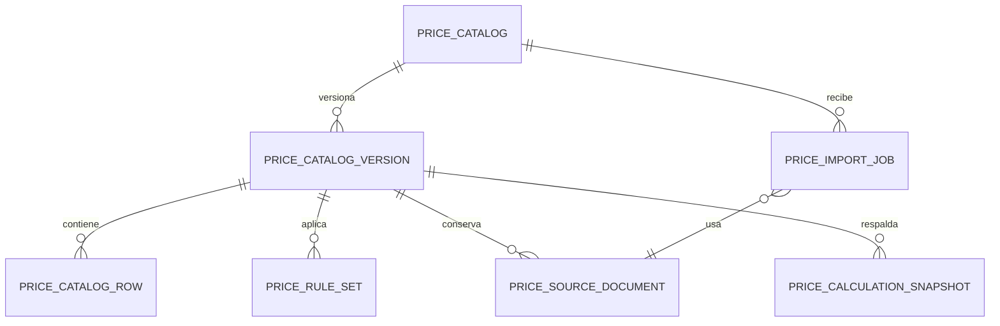
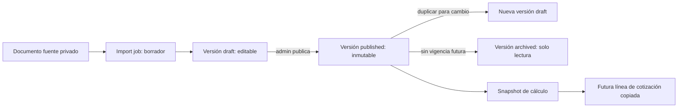

# Fase 1 — Arquitectura y contratos del catálogo calculable

**Estado:** diseño listo para una futura migración independiente. Este documento no cambia el catálogo `Producto`, no crea una API pública, no selecciona IA/OCR y no modifica el módulo de IA legacy congelado.

## Decisiones de arquitectura

- El catálogo calculable es un dominio separado de Productos. Una conversión posterior creará una línea de cotización con la descripción y el precio calculados; nunca modificará automáticamente un `Producto`.
- Se entregan plantillas Inkora y campos personalizados controlados por esquema. No existen columnas rígidas por tipo de imprenta.
- El tenant se obtiene del usuario autenticado en backend; ningún `tenant_id`, `company_id` o `empresa_id` enviado por el navegador determina acceso.
- Los importes se guardan con precisión decimal (`NUMERIC` en PostgreSQL; `Decimal` en aplicación). Los atributos variables se guardan como JSONB en PostgreSQL y como JSON compatible en SQLite de pruebas.
- Una versión publicada es inmutable. Cambiar precios duplica la versión publicada a un borrador. Solo una versión puede estar vigente para un catálogo y un instante determinados.
- Solo el administrador tenant crea, importa, edita, publica o archiva. Operador y vendedor solo podrán consultar/calcular en la futura entrega y nunca ver costos. Superadmin no interviene en el flujo ordinario del tenant.
- Los originales se retienen mientras exista la versión que los referencia. El almacenamiento es privado: `pricing-imports/{tenant_id}/{version_id}/{document_id}/{filename}`.
- IA futura solo podrá proponer un borrador de importación. Nunca publica precios. No se define proveedor ni modelo en esta fase.

## Entidades conceptuales

| Entidad | Responsabilidad | Campos/garantías esenciales |
|---|---|---|
| `price_catalog` | Identidad estable del catálogo | `id`, `tenant_id`, nombre, categoría, `template_key`, estado general. No contiene la lista editable. |
| `price_catalog_version` | Fotografía versionada del catálogo | `id`, `tenant_id`, `catalog_id`, número, `schema_json`, moneda, `valid_from`, `valid_to`, estado `draft`/`published`/`archived`. El esquema se congela aquí. |
| `price_catalog_row` | Una combinación de atributos con un importe | `tenant_id`, `version_id`, `attributes`, `amount NUMERIC`, moneda, unidad base, cantidad base, `amount_kind` (`cost`/`sale`). Dos columnas de precio se convierten en dos filas. |
| `price_rule_set` | Reglas seguras y versionadas | `tenant_id`, `version_id`, reglas JSON declarativas, orden y estado. Nunca Python, SQL, JavaScript ni expresiones ejecutables. |
| `price_source_document` | Evidencia de importación | `tenant_id`, `version_id`, ruta privada, MIME, hash SHA-256, metadatos, retención y estado. |
| `price_import_job` | Borrador de captura neutral al proveedor | `tenant_id`, `catalog_id`, documento, filas propuestas, errores, estado y revisor. No publica. |
| `price_change_event` | Auditoría de cambios | `tenant_id`, actor autenticado, entidad, valores anterior/nuevo, motivo y fecha. No reutiliza una auditoría sin alcance tenant explícito. |
| `price_calculation_snapshot` | Prueba histórica de un cálculo | `tenant_id`, versión, parámetros, desglose, resultado, moneda y referencia futura a cotización. |



## Esquema dinámico y normalización

Cada versión guarda un `schema_json` que describe sus campos permitidos, por ejemplo `size`, `material`, `width_cm`, `height_cm`, `copies` o `quantity`. Un campo incluye: clave estable, etiqueta, tipo (`string`, `decimal`, `integer`, `boolean` o `enum`), requerido, unidad, opciones y si puede intervenir en una regla. Una plantilla ofrece campos iniciales; el administrador agrega campos bajo ese contrato.

Una matriz como “Sobre Pago / Bond / Manila” se normaliza así, no como columnas rígidas:

```json
{
  "attributes": {"description": "PAGO", "width_cm": "10.8", "height_cm": "18", "material": "BOND"},
  "amount": "13.000000",
  "amount_kind": "sale",
  "base_unit": "millar",
  "base_quantity": "1000"
}
```

Los valores que se calculan se conservan además de su entrada y del desglose. Por ello una cotización histórica no cambia cuando se publica una lista posterior.

## Reglas seguras

El motor futuro interpreta una lista de operaciones con entradas tipadas. El conjunto inicial permitido es: `lookup`, `tier`, `composition`, `measurement`, `percentage`, `minimum` y `rounding`. Los límites de entrada, divisiones permitidas, referencias a filas y precisión se validan antes de publicar.

```json
{
  "operations": [
    {"op": "lookup", "source": "component_rows", "match": {"size": "$size", "layer": "$layer"}, "as": "component_price"},
    {"op": "composition", "items": "$layers", "value": "component_price", "as": "base"},
    {"op": "minimum", "value": "$base", "minimum": "50.000000", "as": "after_minimum"},
    {"op": "rounding", "value": "$after_minimum", "mode": "half_up", "scale": 2, "as": "total"}
  ]
}
```

El ejemplo es contrato de datos, no código ejecutable. Un publicador debe rechazar operaciones fuera de la lista, referencias circulares, atributos inexistentes, moneda incompatible, resultado no finito o precisión superior a la política definida.

## Estados y transiciones



- `draft`: editable por administrador; puede recibir importaciones y correcciones.
- `published`: solo lectura. La publicación se ejecuta transaccionalmente y verifica que no quede solapamiento de vigencias.
- `archived`: solo lectura; conserva historial, documentos y snapshots relacionados.
- No hay borrado físico de una versión, fila, regla o fuente mientras una versión o snapshot histórico dependa de ello. Se archiva o se bloquea con un error de dependencia.

## Permisos futuros

| Operación | Administrador tenant | Operador | Vendedor | Superadmin |
|---|---:|---:|---:|---:|
| Crear/editar catálogo y borrador | sí | no | no | no en flujo ordinario |
| Subir fuente e iniciar importación | sí | no | no | no en flujo ordinario |
| Publicar/archivar | sí | no | no | no en flujo ordinario |
| Consultar precio de venta y calcular | sí | sí | sí | no aplica |
| Consultar costo | sí, cuando proceda | no | no | no en flujo ordinario |
| Descargar fuente privada | sí, con ownership | no | no | no en flujo ordinario |

Cada operación valida tenant, rol, ownership del catálogo-versión-documento y estado. Ocultar un botón en frontend no reemplaza estas validaciones.

## Contratos futuros, sin exponer endpoints todavía

Los futuros contratos deberán cubrir, como mínimo:

| Recurso/operación futura | Entrada mínima | Respuesta o validación |
|---|---|---|
| Crear catálogo | nombre, categoría, plantilla | catálogo tenant-scoped; error de esquema inválido |
| Crear/duplicar borrador | catálogo propio, versión origen opcional | versión nueva con número correlativo por catálogo |
| Actualizar filas | versión `draft`, filas normalizadas | errores por atributo, moneda, unidad o duplicado lógico |
| Guardar reglas | operaciones declarativas | error por operación no permitida, ciclo o referencia inválida |
| Importar fuente | archivo privado, versión borrador | job con propuestas, errores y campos ambiguos |
| Publicar | versión `draft`, vigencia, motivo | publicación atómica o conflicto de vigencia |
| Calcular | versión publicada, parámetros tipados | importe, moneda, filas/reglas aplicadas y desglose |
| Convertir a cotización | snapshot calculado autorizado | descripción e importe copiados; Productos intactos |

Errores contractuales sugeridos: `pricing.catalog_not_found`, `pricing.version_not_editable`, `pricing.version_conflict`, `pricing.schema_invalid`, `pricing.rule_not_allowed`, `pricing.cost_forbidden`, `pricing.source_forbidden`, `pricing.dependency_exists` y `pricing.calculation_invalid`. Se deben mapear a respuestas HTTP solo en la fase de API.

Un snapshot de cálculo tendrá, como mínimo, este formato:

```json
{
  "catalog_version_id": "uuid-or-integer",
  "parameters": {"size": "A12", "layers": ["CB", "CFB", "CF"], "quantity": 1000},
  "breakdown": [{"kind": "component", "key": "CB", "amount": "25.000000"}],
  "result": {"amount": "75.000000", "currency": "PEN", "base_quantity": "1000"}
}
```

## Persistencia, índices y aislamiento

En PostgreSQL se prevén FKs, índices por cada FK y compuestos por `(tenant_id, status, valid_from, valid_to)` para versiones, `(tenant_id, version_id)` para filas/reglas/documentos/snapshots y `(tenant_id, catalog_id, version_number)` único. Los atributos JSONB tendrán un índice GIN solo para consultas que realmente se habiliten; las claves de filtro frecuente pueden recibir índices de expresión después de medir uso.

SQLite de pruebas utilizará el tipo JSON de SQLAlchemy y la misma validación en aplicación. No se dependerá de operadores o índices exclusivos de JSONB para establecer permisos, vigencia, unicidad o exactitud de cálculo. PostgreSQL será la autoridad de producción; las pruebas SQLite cubren el contrato funcional y una suite PostgreSQL cubrirá los índices y restricciones específicas antes de liberar.

El bucket de Storage será privado. El backend autoriza toda carga/lectura con tenant derivado de sesión y comprueba el ownership contra `price_source_document`; URLs firmadas tendrán duración corta. Las credenciales de servicio no se envían al cliente. Las políticas de Storage y las RLS de tablas expuestas se diseñarán junto con la migración; el backend seguirá validando ownership incluso si usa una credencial privilegiada.

## Matriz de amenazas

| Riesgo | Control de diseño | Prueba futura |
|---|---|---|
| IDOR entre tenants | tenant derivado de JWT, filtros obligatorios, ownership explícito | intentar acceder a catálogo, versión y job de otro tenant |
| Fuga de costos | `amount_kind`, DTOs separados y autorización server-side | vendedor/operador no reciben costo ni en desglose |
| Publicación accidental | solo admin, versión `draft`, validación completa y transición atómica | importación/corrección no puede publicar; conflicto de vigencia falla |
| Archivos cruzados | ruta con tenant/version/documento, bucket privado y verificación de hash/ownership | URL o ID de fuente ajena es denegada |
| Manipulación de fórmulas | DSL con lista blanca y datos tipados; no `eval` ni código arbitrario | operación desconocida, ciclo y referencia ajena son rechazados |
| Pérdida de historial | versiones/snapshots inmutables y borrado bloqueado por dependencia | cotización conserva importe de la versión antigua |

## Pruebas de escritorio del diseño

| Escenario | Representación acordada |
|---|---|
| 1. Autocopiativo CB/CFB/CF | filas por componente + regla `composition` + snapshot con desglose |
| 2. Sobre por medida y material | filas normalizadas con dimensiones y `material` |
| 3. Bolsa con dimensiones y recargos | atributos de dimensión + `measurement` + `percentage`/recargo declarado |
| 4. Precio por tramos | filas/rule `tier` con límites inclusivos explícitos |
| 5. Aumento masivo 10 % | duplicar `published` a `draft`, aplicar operación revisable y publicar nueva versión |
| 6. Corregir celda extraída | propuesta en `price_import_job`; corrección solo en `draft` |
| 7. Dos tenants, mismo nombre | identidad y consultas siempre incluyen `tenant_id` derivado |
| 8. Cotización histórica | `price_calculation_snapshot` conserva versión, parámetros y total |
| 9. Vendedor calcula sin costos | consulta de venta filtrada por rol; costo nunca serializado |
| 10. Eliminación con dependencias | archivar o `pricing.dependency_exists`; no borrado físico |

## Trabajo posterior, deliberadamente no generado

1. Migración independiente: tablas, FKs, restricciones, índices, RLS y política privada de Storage.
2. Modelos SQLAlchemy/Pydantic y servicios de versionado/cálculo, sin tocar Productos.
3. Endpoints tenant-scoped y pruebas de permisos/ownership.
4. UI de borrador, revisión, publicación y edición de listas, en un bloque separado del backend.
5. Importación manual y validación; solo después evaluar OCR/IA como generador de borradores.
6. Conversión a cotización con snapshot inmutable y pruebas de trazabilidad.

Las decisiones de modelo de IA, OCR y proveedor permanecen explícitamente abiertas y fuera del alcance de esta fase.
